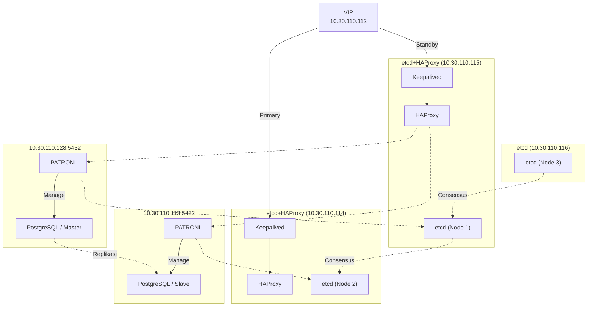

# Plan: PostgreSQL HA Cluster Deployment (Agent Execution Plan)

**Target OS:** Rocky Linux 9.7 (air-gapped, no internet access)
**Cluster:** Patroni + etcd (3 node) + HAProxy + Keepalived

## Diagram



## Node Inventory

| Role | IP | Services |
|---|---|---|
| VIP | `10.30.110.112` | - (dikelola Keepalived) |
| Node A | `10.30.110.114` | Keepalived, HAProxy, etcd (Node 2) |
| Node B | `10.30.110.115` | Keepalived, HAProxy, etcd (Node 1) |
| Node C | `10.30.110.116` | etcd (Node 3) |
| Node D | `10.30.110.128` | Patroni + PostgreSQL (Master) |
| Node E | `10.30.110.113` | Patroni + PostgreSQL (Slave) |

---

## Section 1 — Gathering Dependencies (Offline Bundle)

**Prasyarat:** 1 mesin builder ber-internet, OS = Rocky Linux 9.7 (sama persis dengan target, arch x86_64).

### 1.1 Setup builder & aktifkan repo

```bash
dnf install -y epel-release
dnf install -y https://download.postgresql.org/pub/repos/yum/reporpms/EL-9-x86_64/pgdg-redhat-repo-latest.noarch.rpm
dnf install -y createrepo_c
```

### 1.2 Verifikasi ketersediaan paket sebelum download

```bash
dnf search patroni
dnf search etcd
dnf list postgresql16-server
```
> Kalau `patroni` tidak tersedia sebagai RPM di repo aktif, siapkan jalur `pip download` sebagai fallback (lihat 1.4).

### 1.3 Download semua RPM + dependency

```bash
mkdir -p /root/offline-rpms
dnf download --resolve --alldeps --destdir=/root/offline-rpms \
  postgresql16-server postgresql16-contrib postgresql16-libs \
  patroni etcd haproxy keepalived \
  chrony firewalld policycoreutils-python-utils
```

### 1.4 (Fallback) Download dependency Python via pip

```bash
mkdir -p /root/offline-pip
pip download patroni[etcd3] -d /root/offline-pip --no-binary :none:
```

### 1.5 Build repo lokal

```bash
createrepo_c /root/offline-rpms
```

### 1.6 Package & transfer

```bash
tar czf pgha-offline-bundle-10-Jul-2026.tar.gz offline-rpms offline-pip
# transfer via scp/rsync ke jump host, atau media fisik (USB/DVD) ke jaringan air-gapped
```

### 1.7 Test install di 1 VM offline (disconnect network)

```bash
tar xzf pgha-offline-bundle-10-Jul-2026.tar.gz -C /root/
cat <<EOF > /etc/yum.repos.d/local-offline.repo
[local-offline]
name=Local Offline Repo
baseurl=file:///root/offline-rpms
enabled=1
gpgcheck=0
EOF
dnf clean all
dnf install -y postgresql16-server patroni etcd haproxy keepalived
```
> Kalau ada paket yang gagal resolve, catat, download ulang di builder, ulangi 1.5–1.7 sebelum lanjut ke node production.

### Checklist Section 1

- [ ] Builder Rocky Linux 9.7 siap, repo EPEL + PGDG aktif
- [ ] Semua RPM + dependency ter-download (`--resolve --alldeps`)
- [ ] Fallback pip package tersedia (kalau `patroni` bukan RPM native)
- [ ] Repo lokal (`createrepo_c`) berhasil dibuat
- [ ] Bundle ditransfer ke internal storage/jump host
- [ ] Test install offline di 1 VM berhasil tanpa error dependency

---

## Section 2 — Konfigurasi Cluster

### 2.1 Setup repo lokal di semua node target

```bash
cat <<EOF > /etc/yum.repos.d/local-offline.repo
[local-offline]
name=Local Offline Repo
baseurl=file:///root/offline-rpms
enabled=1
gpgcheck=0
EOF
dnf clean all
```

### 2.2 etcd Cluster (Node A `.12`, Node B `.13`, Node C `.14`)

```bash
dnf install -y etcd
```
Edit `/etc/etcd/etcd.conf` di tiap node — set `ETCD_NAME` unik, `ETCD_INITIAL_CLUSTER` berisi ketiga member (`name1=http://10.30.110.114:2380,name2=http://10.30.110.115:2380,name3=http://10.30.110.116:2380`), `ETCD_INITIAL_CLUSTER_STATE=new`, `ETCD_LISTEN_PEER_URLS`/`ETCD_LISTEN_CLIENT_URLS` sesuai IP node.

```bash
systemctl enable --now etcd
etcdctl member list
etcdctl endpoint health --cluster
```

### 2.3 PostgreSQL + Patroni (Node D `.10` = Master, Node E `.11` = Slave)

```bash
dnf install -y postgresql16-server postgresql16-contrib patroni
```
Buat `/etc/patroni.yml` di kedua node — `scope` sama, `etcd3.hosts` mengarah ke ketiga etcd node (`10.30.110.114:2379,10.30.110.115:2379,10.30.110.116:2379`).

```bash
# Node D dulu (jadi Leader/Master)
systemctl enable --now patroni
# Node E setelahnya (auto-join sebagai Replica)
systemctl enable --now patroni

patronictl -c /etc/patroni.yml list
```

### 2.4 HAProxy (Node A `.12`, Node B `.13`)

```bash
dnf install -y haproxy
```
Edit `/etc/haproxy/haproxy.cfg` — backend health-check ke Patroni REST API (`10.30.110.128:8008/master`, `10.30.110.113:8008/master`), frontend listen port `5432`.

```bash
systemctl enable --now haproxy
```

### 2.5 Keepalived + VIP (Node A `.12` = MASTER, Node B `.13` = BACKUP)

```bash
dnf install -y keepalived
```
Edit `/etc/keepalived/keepalived.conf`:
- Node A: `state MASTER`, priority tinggi
- Node B: `state BACKUP`, priority rendah
- `virtual_ipaddress { 10.30.110.112 }` di kedua node
- `track_script` cek proses `haproxy` lokal

```bash
systemctl enable --now keepalived
ip addr show | grep 10.30.110.112
```

### 2.6 Verifikasi end-to-end

```bash
psql -h 10.30.110.112 -p 5432 -U postgres -c "SELECT pg_is_in_recovery();"
# false = terhubung ke Master via VIP → benar
```

### Checklist Section 2

- [ ] Repo lokal aktif di semua node
- [ ] etcd cluster 3 node sehat (quorum tercapai)
- [ ] Patroni: 1 Leader + 1 Replica, replikasi streaming jalan
- [ ] HAProxy routing ke Master aktif (health-check via Patroni API)
- [ ] Keepalived: VIP hanya aktif di satu node
- [ ] Koneksi client via VIP berhasil & terarah ke Master
